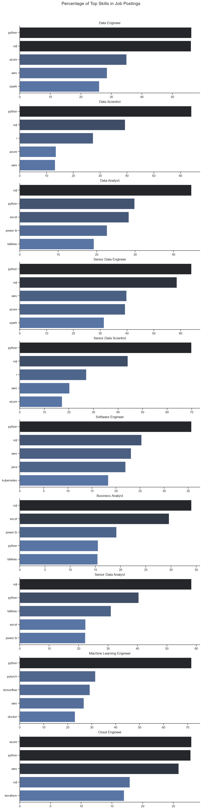
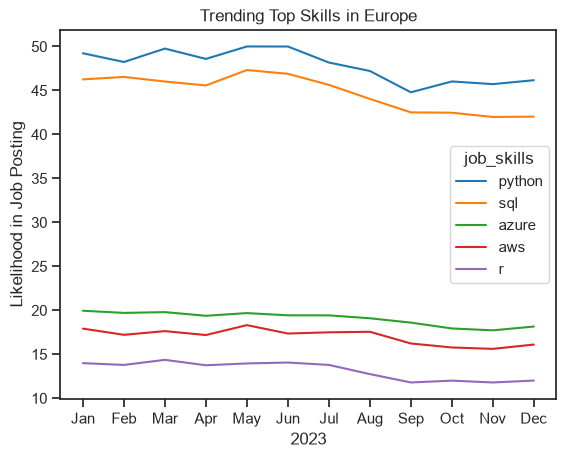
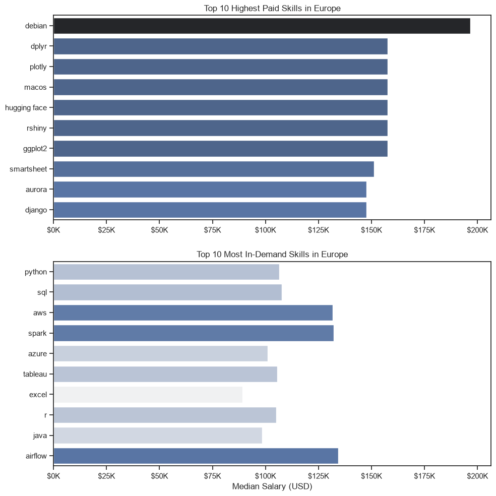
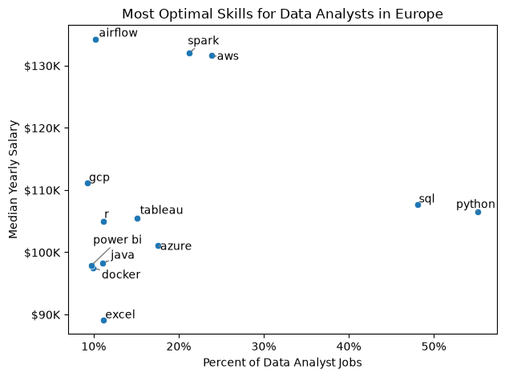

# The Analysis

## 1. What are the most demanded skills?

View my notebook with detailed steps here:
[2_Skills_Count.ipynb](2_Skills_Count.ipynb)

### Results:

### Insights:
* **Python and SQL dominance**: Python and SQL are the most demanded skills across major data roles. For instance, in Data Engineer postings, Python appears in 56.2% of the listings, closely followed by SQL at 56.0%.
* **Data Scientist preferences**: For Data Scientists, Python is highly critical, appearing in 64.0% of the job postings.
* **Data Analyst preferences**: SQL is the top skill for Data Analysts, featured in 44.6% of the listings.
* **Cloud technologies**: Cloud platforms like Azure are notably prominent for Data Engineers, appearing in 34.9% of postings.

## 2. How are in-demand skills trending?

### Results:

*Data from 2023*

### Insights:
* **Stable demand for core skills**: The demand for foundational skills like Python and SQL remained relatively stable throughout the year, with Python hovering around 45% to 50% and SQL around 42% to 47%.
* **Consistent cloud and big data trends**: Skills like AWS, Azure, and Spark maintained a consistent presence month over month, indicating a steady, year-round need for cloud infrastructure and big data processing capabilities rather than seasonal spikes.

## 3. How well do jobs and skills pay in Europe?

### Salary analysis

### Results:

### Insights:
* **Premium for Data Engineering tools**: Big data and orchestration tools command the highest salaries. For example, Airflow offers a median salary of $134,241, Spark sits at $132,040, and AWS developers earn around $131,580.
* **Strong baseline for core skills**: While Python and SQL are not the absolute highest-paying niche skills, they offer solid median salaries of $106,439 and $107,719, respectively.

## 4. What is the most optimal skill to learn?

### Insights:
* **The "Golden" Quadrant**: Cloud and big data technologies such as AWS and Spark represent the most optimal advanced skills to learn. They offer highly competitive median salaries (over $130K) while maintaining strong market demand (featured in 23.9% and 21.2% of job postings, respectively).
* **Must-Have foundations**: Python and SQL stand out as the ultimate foundational skills. With an overwhelming presence in 55.1% and 48.0% of job postings, they are mandatory prerequisites for entering the European data market.